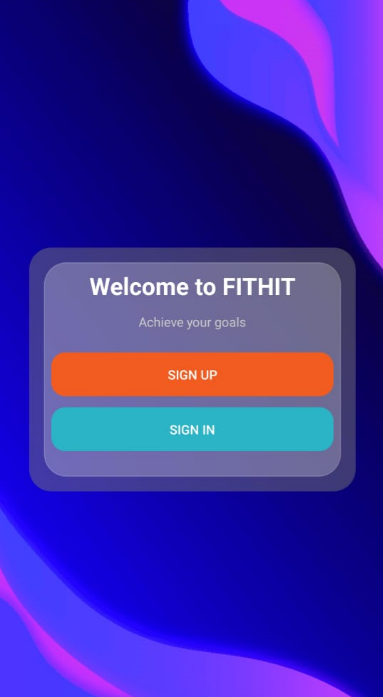
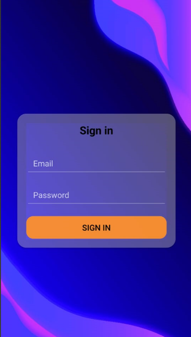
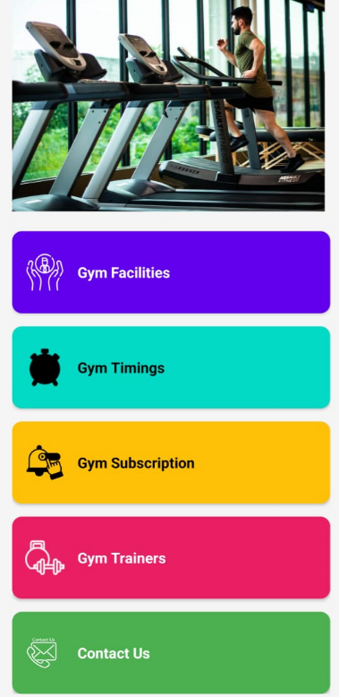
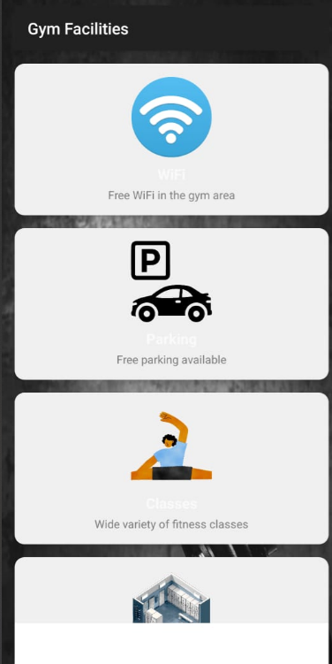
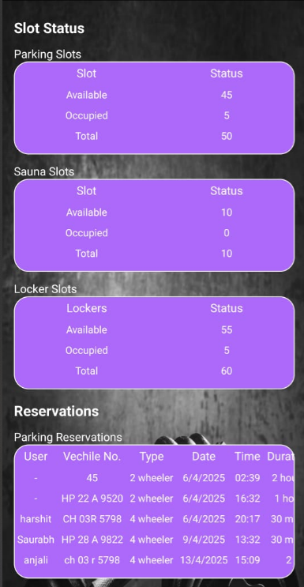
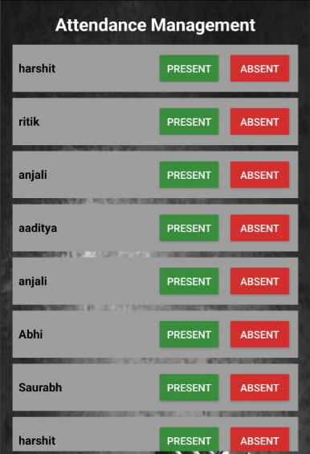
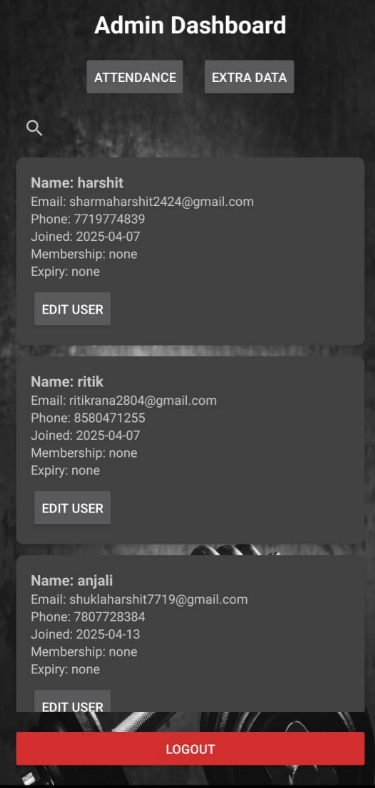
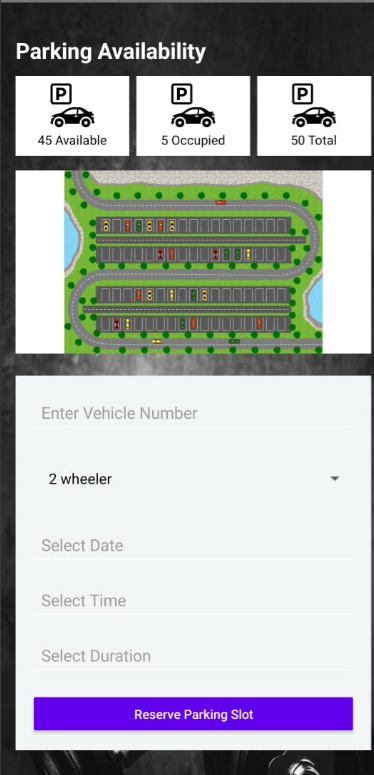
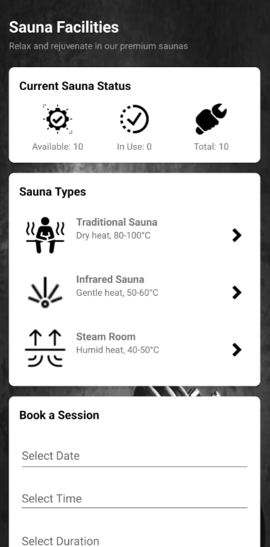

# 💪 FitHit Gym Android App

An all-in-one Android application for gym members and admins. FitHit offers features like class booking, sauna & locker reservations, parking availability, attendance tracking, and an admin dashboard — all integrated with **Firebase Realtime Database** for real-time data updates.

---

## 📱 Features

### 👤 User Side
- **Dashboard View**: Personalized overview of user's attendance, sauna, locker, and parking info
- **Sauna Booking**: Book sauna slots with real-time availability updates
- **Locker Booking**: Reserve lockers and check availability on a map-based interface
- **Parking Reservation**: View parking slot status and reserve spots
- **Attendance Tracker**: View your monthly attendance and gym visit stats
- **Membership Info**: View current plan and expiry date

---

### 🛠️ Admin Side
- **Login with Credentials**: `fithitchd057@gmail.com` / `24MCA20057`
- **User Management**: View, edit, delete, or reset user data
- **Attendance Control**: Mark users as present/absent and send SMS notifications
- **Data Dashboard**: Table view of all users with membership, contact, and activity data

---

## 🧩 Tech Stack

- **Language**: Kotlin (Kotlin DSL)
- **Architecture**: MVVM + LiveData
- **Firebase Realtime Database**: User data, availability status, and bookings
- **Firebase Authentication**: (Optional for future enhancement)
- **Material Design Components**: Consistent and modern UI
- **Accessibility Enhancements**: Form labels, dynamic hints, and proper contrast

---

## 🗂️ Major Modules

| Module           | Description |
|------------------|-------------|
| `SaunaActivity`  | Sauna booking with availability check |
| `LockerActivity` | Locker reservation and map view |
| `ParkingActivity`| Parking status display and reservation form |
| `DashboardActivity`| User overview with data fetch from Firebase |
| `AdminDashboardActivity` | Admin overview of all users |
| `AttendanceDataActivity` | Attendance management and SMS sending |

---

## 🔐 Admin Login
Username: admin
email: fithitchd057@gmail.com
Password: 24MCA20057

> Admin can access full user data, update records, and send notifications.

---

## 🔮 Future Enhancements

- Google Sign-In integration for user authentication
- Notifications for upcoming reservations or expiring memberships
- Cloud Firestore migration for scalability
- Graphs & Analytics for admin insights
- QR code check-in for attendance

---

## 📸 Screenshots

  
  
  

  
  
  

  
  

  
  

## 📄 License

This project is open-source and free to use under the MIT License.

---

## 👨‍💻 Developed By

**Abhinash (24MCA20057)**  
Master of Computer Applications  
Chandigarh University

---
## 📦 Installation

